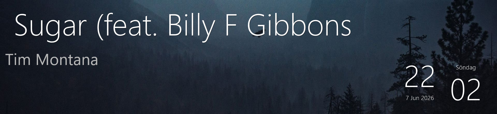

# rainmeter-tidal-bar-display



Rainmeter setup for an ultrawide **"bar" secondary monitor** (e.g. 1920×440):

- 🕐 A **Typography clock** (Swedish weekday/date)
- 🎵 A live **TIDAL "now playing"** widget — **album art** + title + artist, updated in real time, with long titles **scrolling sideways (marquee)**

The TIDAL widget reads **Windows System Media Transport Controls (SMTC)** — the same now-playing info shown in the Windows media popup — so it follows **TIDAL** (desktop app or browser), and in fact almost any media app.

## How it works

A tiny background reader (`poller/poll-smtc.ps1`) polls SMTC and writes the current track to
`%LOCALAPPDATA%\TidalNowPlaying\nowplaying.txt`. On each track change it also looks up the **album art** via the iTunes Search API and downloads it next to that file. The Rainmeter skin **`TidalNowPlaying`** reads that file every second and renders the cover + text on the bar.

> ⚠️ The reader must run under **Windows PowerShell 5.1** (`powershell.exe`) — PowerShell 7 dropped the built-in WinRT projection needed for SMTC. The included `launch-poller.vbs` handles that, runs it hidden, and auto-starts it at logon.

## Install (on a new PC)

1. Connect the bar monitor.
2. Install **[Rainmeter](https://www.rainmeter.net)** and **TIDAL**.
3. Double-click **`INSTALL.cmd`**.

The installer:

- copies both skins to `Documents\Rainmeter\Skins`
- installs the background reader to `%LOCALAPPDATA%\TidalNowPlaying` and **fixes the path for the current user**
- adds the reader to **Startup** (auto-start at logon) and starts it now
- turns the **taskbar off on the secondary display**
- loads and **positions** the now-playing (top-left) and the clock (bottom-right) on the bar
- sets a wallpaper on the bar **if** you place a `wallpaper.jpg` next to `INSTALL.cmd`

Then just play a track in TIDAL. `README.txt` has the same steps in Swedish.

## Customization

Edit `Skins\TidalNowPlaying\TidalNowPlaying.ini` (or right-click the skin → *Edit skin*):

- **Colours / fonts / size** — the `[Variables]` block and each meter's `FontSize`.
- **Scroll speed** — long titles scroll via `marquee.lua`; raise `UpdateDivider` on `[MeasureScroll]` to slow it down, or change `#Window#` (number of visible characters).
- **Album art** — fetched from the iTunes Search API on each track change (cover left, text right). To hide it, remove the `[MeterCover]` / `[mCover]` sections and set the text X back to `20`.
- **Position** — drag the skin on the bar, or right-click → *Settings*.

## Troubleshooting

**Widget is blank**

- Make sure something is playing or paused in TIDAL — it's empty when there's no active media session.
- Check the reader is running:
  ```powershell
  Get-CimInstance Win32_Process -Filter "Name='powershell.exe'" |
    Where-Object { $_.CommandLine -like '*poll-smtc.ps1*' }
  ```
- Restart it by running `%LOCALAPPDATA%\TidalNowPlaying\launch-poller.vbs` (or just sign out and back in — it auto-starts).
- See what it's writing: open `%LOCALAPPDATA%\TidalNowPlaying\nowplaying.txt`.

**Nothing updates / wrong text**

- The reader must run under **Windows PowerShell 5.1** (the `.vbs` ensures this). PowerShell 7 can't read SMTC.
- Right-click the skin → *Refresh skin*.

## Uninstall

1. Right-click the skin → *Unload skin*.
2. Delete `%LOCALAPPDATA%\TidalNowPlaying`.
3. Remove auto-start: open `shell:startup` and delete `TidalNowPlaying.vbs`.
4. *(Optional)* delete the skins from `Documents\Rainmeter\Skins`.

## Notes

- **Works with more than TIDAL:** because it reads SMTC, it also shows **Spotify, Windows Media Player, browsers** and most media apps. `poll-smtc.ps1` prefers a TIDAL session and otherwise falls back to whatever is currently playing.
- TIDAL returns **no cover art** via SMTC (the thumbnail reference is present but empty), so album art is fetched from the free **iTunes Search API** by artist + title. Mainstream tracks match reliably; obscure ones may miss, in which case the widget just shows title + artist. Note: the lookup sends the current artist + title to Apple over the internet.
- Long titles **scroll sideways (marquee)** so the whole title can be read; short titles stay still.
- If a skin lands in the wrong spot, just drag it onto the bar.
- Moving the clock sideways but it "sticks"? Right-click it → *Settings* → uncheck **Keep on screen** (its window is wider than the bar).
- No wallpaper is bundled — supply your own.

## Credits & license

- This project's own code (TIDAL widget, SMTC reader, installer) is released under the **MIT License** — see [LICENSE](LICENSE).
- The bundled **Typography** clock skin is by Alex Guerrieri (*klaidliadon*) under a **Creative Commons** license and remains under its own terms.
- Built with the help of Claude.
